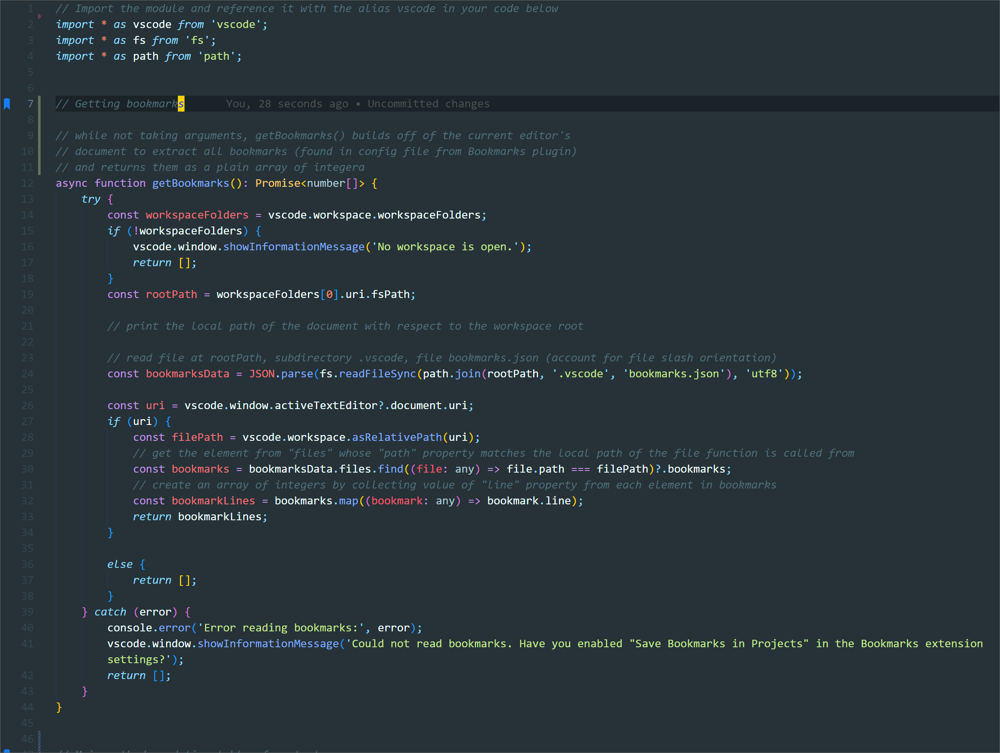

# Bookmarks Table of Contents Generator

This extension generates and keeps updated a comment at the top of your file containing a "table of contents" of all of your bookmarks, helping both others and yourself to learn and navigate larger files.

## Demo

  

## Features

- Made as support for the "Bookmarks" extension by Alessandro Fragnani.
- Creates and updates a comment (regardless of language) containing all bookmarks and their line numbers.
- Great for helping readability of public code, as well as navigating yourself around your larger files.
- Keeps up with any amount of adding, removing, or shifting bookmarks.
- Easy to call with a single hotkey, in line with "Bookmark"'s hotkey structure, and does not run in the background otherwise.

## Requirements

NOTE: you must have the following for this extension to work:

1. The "Bookmarks" extension by Alessandro Fragnani.
2. Within the "Bookmarks" extension settings, have "Save Bookmarks in Project" enabled.

## Notice

PLEASE NOTE: this extension is modifying your document in order to update the table of contents comment. The extension will tell you exactly what lines it is updating. Please take percaution, and note how exactly the extension is currently detecting the table of contents in order to not induce unintended behavior.

*How it works*: The program looks for two separate occurances of the "separator" string (it can be preceded by up to 5 characters to account for comments). If it finds two, then it deletes everything inbetween (inclusive) to update the new table of contents.
## Extension Settings

You can modify the following through settings:

* `bookmarks-toc-gen.separator`: The separator string to use for the table of contents.
* `bookmarks-toc-gen.maxLinesSearch`: Number of lines from beginning of document to search for pre-existing table of contents. Adjust for performance.

## Known Issues

Please make sure you review the notice. There will inevitably be some edge cases in the existing table of contents detection and deletion; I have tried to cover them all, but edge cases may remain.

## Release Notes

### 1.0.0

Initial release!

### 1.0.1

Fixed some language-related compatibility issues with comments, added notice.

### 1.0.2

Removed explicit dependency on Bookmarks to allow loading into remote session, instead added error message if no bookmarks detected.
---

**Enjoy!**
